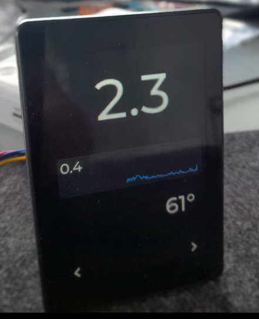

# SailScreen

A touchscreen marine dashboard for ESP32-S3 featuring GPS speed, compass, chart, and ESP-NOW peer networking. Configure peers and view navigation data directly on the device—no webserver required. Supports microSD logging and is optimized for the JC3248W535 display.

---

## Device

- **Model:** JC3248W535 (ESP32-S3, 3.5" capacitive touch IPS, 8M PSRAM, 16M flash, 320x480)
- **Display:** axs15231b (QSPI)
- **Touch:** axs15231b (I2C)
- **MicroPython compatible**
- **microSD card:** Used for logging GPS data and storing files.

## Connectivity

- **GPS:** NEO6Mv2
- **Wireless:** ESP-NOW

---

## Features

- Parse GPS data and display on screen.
- **Screen 1 (Main):**
  - Speed (knots)
  - Direction (compass)
  - Chart (average speed indicator)
  - Average speed (small text above chart)
- **Screen 2 (GPS Info):**
  - Latitude / Longitude (as floats)
  - Satellite count and GPS fix status (2D/3D/No Fix)
  - Navigation buttons 
- **Screen 3 (ESP-NOW Peer Management):**
  - Form to add/remove ESP-NOW peer MAC addresses (no webserver needed)
  - MAC addresses are stored in `/peers.txt` on the device
  - Navigation buttons 
- **ESP-NOW:**
  - Device sends speed and compass data to all peers listed in `/peers.txt`
  - Peers can be managed directly from the device UI (screen 3)
- **microSD card:**
  - Used for logging GPS data and storing files (future feature)
- **Touchscreen navigation:**

---

